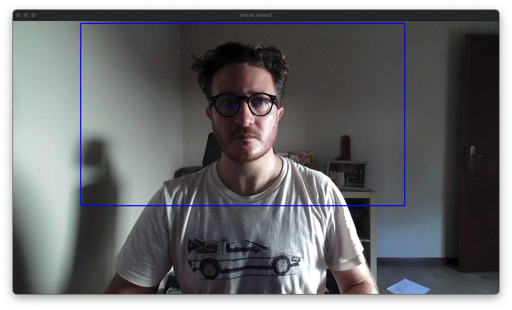
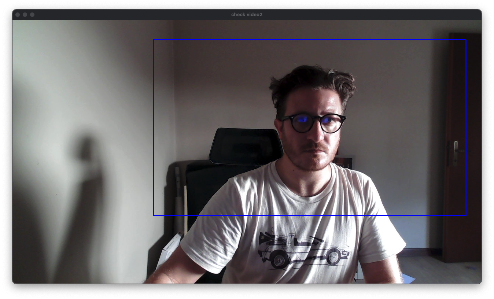
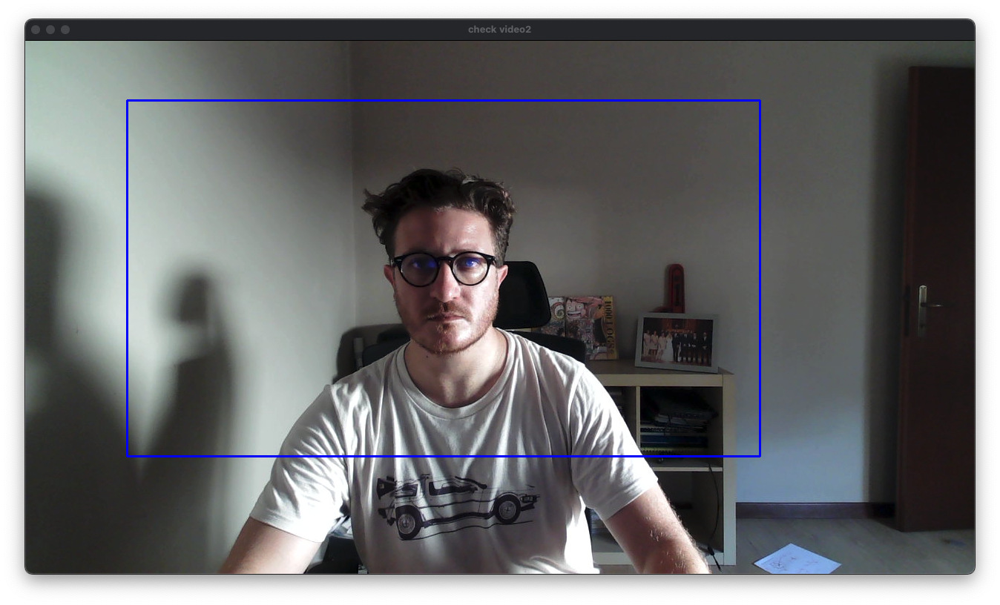

# Head Tracking
An advanced script that turns your standard webcam into an intelligent virtual camera. Using MediaPipe, the system detects and tracks your face in real-time, keeping you perfectly centered in the frame at all times.

It's the ideal solution for enhancing the quality of your video conferences, online classes, and streaming sessions without needing expensive hardware.
<br>
<p align="center">
  
  
  
</p> 
<br>

## Key Features
* 👤 Automatic Face Tracking: Always keeps the subject stable and centered.
* 🔎 Dynamic Zoom: Crops the frame for a more professional look, removing unnecessary empty space.
* ✨ Smooth Movement: Uses smoothing algorithms (moving and weighted averages) to prevent jerky camera motion.
* 🚀 Motion Prediction: If the face is momentarily lost, the system predicts its position to maintain fluid motion.
* 🔧 Highly Configurable: Customize every aspect via command-line arguments (zoom, smoothness, resolution, FPS, etc.).
* 🖥️ Headless Mode: Can be run on a server or in the background without displaying preview windows.
* ✅ High Compatibility: Works with most applications that accept a video source, such as OBS, Zoom, Google Meet, Discord, and Teams.

## Prerequisites
Before you begin, make sure you have the following installed:

1. Python 3.8 or higher.
2. A physical webcam connected to your computer.
3. Virtual camera software. This acts as the "driver" that allows other applications to see the script's output. The most common choice is OBS Studio. Install OBS and activate its "Virtual Camera" from the controls panel.

   
## Python

This code is tested to work with Python 3.11.

## Installation

```bash
git clone git@github.com:giova86/Python-webcamTracking.git
cd Python-webcamTracking
python3.11 -m venv venv
source venv/bin/activate
pip install -r requirements.txt
```

## Run and optional arguments

```
python app_trackFace.py
```

### Command-Line Arguments
Customize the script's behavior with the following arguments:

```bash
usage: main.py [-h] [-a ACTIVE_AREA] [-s AVERAGE_SMOOTH] [-ow PREFERRED_WIDTH] [-oh PREFERRED_HEIGHT] [-c CAMERA_ID]
               [-f CAMERA_FPS] [-w WEIGHT_RECENT] [--no-display]

Face-tracking virtual camera using MediaPipe.

options:
  -h, --help            show this help message and exit
  -a ACTIVE_AREA, --area ACTIVE_AREA
                        Active area for tracking (e.g., 1.2 for 20% zoom). Default is 1.2
  -s AVERAGE_SMOOTH, --smooth AVERAGE_SMOOTH
                        Number of frames to average for smooth tracking. Default is 30.
  -ow PREFERRED_WIDTH, --output_width PREFERRED_WIDTH
                        Preferred output width of the camera. Default value is 1280px.
  -oh PREFERRED_HEIGHT, --output_height PREFERRED_HEIGHT
                        Preferred output height of the camera. Default value is 720px.
  -c CAMERA_ID, --camera_id CAMERA_ID
                        Camera device ID (an integer from 0 to N). Default is 0.
  -f CAMERA_FPS, --fps CAMERA_FPS
                        Preferred camera FPS. Default is 30.
  -w WEIGHT_RECENT, --weights WEIGHT_RECENT
                        Weight for recent positions (0.0-1.0). Higher values are more responsive but less smooth.
  --no-display          Don't show preview windows (useful for headless operation).
```
